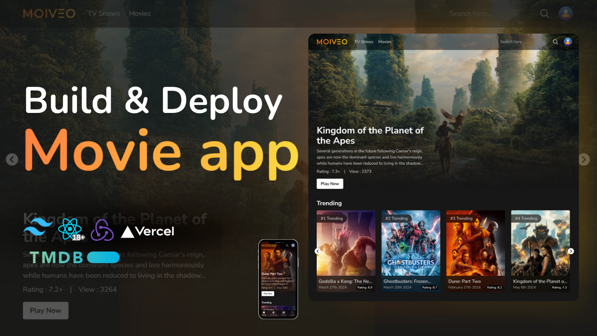

# Moiveo 🎬

## Огляд
**Moiveo** — це сучасний кіно-додаток, що дозволяє користувачам переглядати популярні фільми та телешоу. Додаток використовує дані з **TMDB API** для відображення актуальної інформації про останні тренди кіноіндустрії. Завдяки чудовому UI, швидкому завантаженню та інтеграції з найкращими технологіями, додаток забезпечує неймовірний користувацький досвід.

## Функціонал
- 📽️ **Популярні фільми**: Переглядайте фільми, що в тренді.
- 🎬 **Списки телешоу**: Отримуйте інформацію про останні серіали.
- ⭐ **Оцінки та перегляди**: Дивіться оцінки та кількість переглядів фільмів.
- 🔍 **Пошук**: Легко знаходьте улюблені фільми та телешоу.
- 📱 **Мобільна підтримка**: Адаптивний дизайн для смартфонів і планшетів.

## Технології
Проєкт побудований з використанням сучасних технологій:
- **React** ⚛️ – для створення компонентів інтерфейсу.
- **TailwindCSS** 🎨 – для стильового оформлення та адаптивності.
- **TMDB API** 🎥 – для отримання даних про фільми.
- **Redux Toolkit** 🛠️ – для управління станом додатку.
- **Vercel** 🚀 – для деплою додатку.

## Скріншоти

