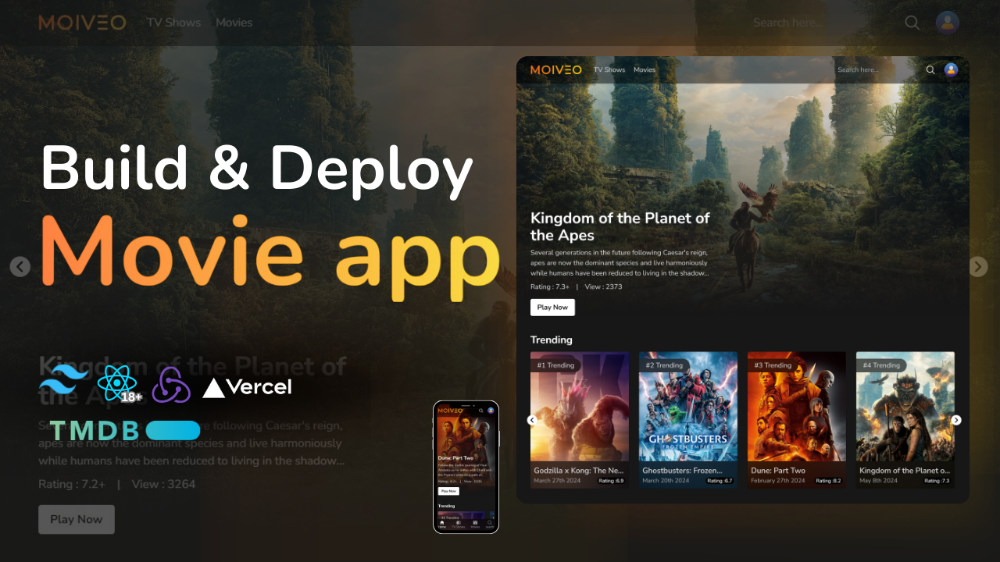

# Moiveo 🎬

## Overview
**Moiveo** is a modern movie application that allows users to explore popular movies and TV shows. The app uses data from **TMDB API** to display up-to-date information on the latest trends in the film industry. With an excellent UI, fast loading, and integration with top technologies, the app delivers an exceptional user experience.

## Features
- 📽️ **Popular Movies**: Browse trending movies.
- 🎬 **TV Show Listings**: Get information on the latest series.
- ⭐ **Ratings and Views**: View movie ratings and watch counts.
- 🔍 **Search**: Easily find your favorite movies and TV shows.
- 📱 **Mobile Support**: Responsive design for smartphones and tablets.

## Technologies
The project is built using modern technologies:
- **React** ⚛️ – for creating user interface components.
- **TailwindCSS** 🎨 – for styling and responsiveness.
- **TMDB API** 🎥 – for retrieving movie data.
- **Redux Toolkit** 🛠️ – for state management.
- **Vercel** 🚀 – for application deployment.

